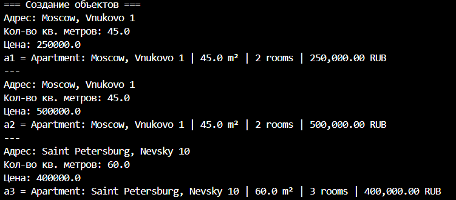
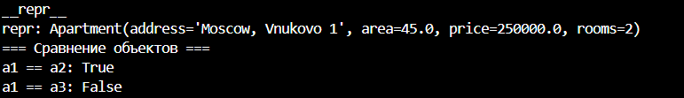
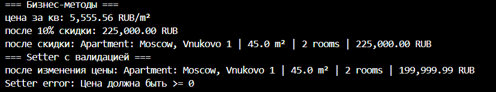

# Сущность: квартира(Apartment)

# Реализованный класс Apartment
**Закрытые поля:**

- `adress` (адрес)
- `area` (площадь)
- `price` (цена)
- `rooms` (кол-во комнат)

**Свойства @property:**
- Чтение: `adres`
- Чтение: `area`
- Чтение: `rooms`
- Чтение и запись: `price`

*Какие инварианты?*

- Адрес - не может быть пусто строкой
- Площадь - число в дипозоне от 1 до 1000 кв.м
- Цена - не может быть отрицательным числом. Тип данных должен соответсовать __int/float__
-Комнаты - число в диапозоне от 1 до 20
--
После измения цены, цена должна пройти проверку на неотрицательное число (apply_discount())

*Что значит “равенство”?*

Равными считаются объектами с одинаковым адресом, кол-вом комнат, площадью, НО отличающейся ценой

*Есть ли состояние?*

Квартира может стоять на продаже/не стоять на продаже (В данной работе это не реализованно)

# магические методы:
- `__str__` - красивый вывод для пользователя
- `__repr__` - техническое представление
используется для отладки
- `__eq__` - сравнение объектов через `==`

# Бизнес методы:
- `price_per_sqm()` - показывает цену за 1 кв. метр
- `apply_discount(self, percent: float)` - применяет скидку

# Демонстрация

## Создание объекта
Cоздание трёх объектов:
Класс: Квартир
**Первый Объект (a1) Квартира с атрибутами:**
- `Адресс` - Moscow, Vnukovo 1
- `Площадь` - 45
- `Цена` - 250000
- `Кол-во комнат` - 2

**Второй Объект (a2) Квартира с атрибутами:**
- `Адресс` - Moscow, Vnukovo 1
- `Площадь` - 45
- `Цена` - 500000
- `Кол-во комнат` - 2

**Третий Объект (a3) Квартира с атрибутами:**
- `Адресс` - Saint Petersburg, Nevsky 10
- `Площадь` - 60
- `Цена` - 400000
- `Кол-во комнат` - 3

# Методы

- Метод `__repr__` - техническое представление
- Метод Сравнениия `__eq__` 

Представляем через repr апартаменты a1. Сравниваем квартиры a1 и а2, а также а1 и а3

**квартира а1 равна а2, потому что у них равны все атрибуты кроме цены.**

## Бизнес методы
- "Прогоняем" через бизнес метод price_per_sqm квартиру а1
- Применяем скидку в 10 процентов для квартиры а1 

 `price_per_sqm()` - показывает цену за 1 кв. метр
 `apply_discount(self, percent: float)` - применяет скидку

## Сценарии проверки валидации

Ниже приведены сценарии тестирования корректности создания объекта, работы сеттеров и метода `apply_discount`. В каждом случае ожидается возникновение ошибки (исключения) с указанным сообщением.

### 1. Некорректное создание объекта

| Действие | Ожидаемая ошибка |
|----------|------------------|
| Создать объект с ценой < 0 | `Цена должна быть >= 0` |
| Создать объект с пустым адресом (`""`) | `Адрес не может быть пустой строкой` |
| Создать объект с адресом, состоящим только из пробелов (`"   "`) | `Адрес не может быть пустой строкой` |
| Создать объект с площадью не числового типа (например, `"abc"`) | `значение должно соответствовать типа данных float` |
| Создать объект с площадью ≤ 0 | `Значение должно быть в диапазоне (0, 1000]` |
| Создать объект с площадью > 1000 | `Значение должно быть в диапазоне (0, 1000]` |
| Создать объект с ценой не числового типа (например, `"abc"`) | `значение должно соответствовать типа данных float` |
| Создать объект с ценой < 0 | `Цена должна быть >= 0` |
| Создать объект с количеством комнат не целого типа (например, `"две"`) | `Неверный тип данных` |
| Создать объект с количеством комнат ≤ 0 | `Количество комнат должно быть в диапазоне [1, 20]` |
| Создать объект с количеством комнат > 20 | `Количество комнат должно быть в диапазоне [1, 20]` |

### 2. Проверки сеттеров (на примере цены)

| Действие | Ожидаемая ошибка |
|----------|------------------|
| Установить цену не числового типа через сеттер | `значение должно соответствовать типа данных float` |
| Установить цену < 0 через сеттер | `Цена должна быть >= 0` |

### 3. Проверки метода `apply_discount`

| Действие | Ожидаемая ошибка |
|----------|------------------|
| Применить скидку не числового типа (например, `"скидка"`) | `percent must be int or float` |
| Применить отрицательную скидку (< 0) | `percent must be in range [0, 100]` |
| Применить скидку > 100 | `percent must be in range [0, 100]` |

Все описанные проверки гарантируют, что объект всегда находится в корректном состоянии, а некорректные операции блокируются с понятными сообщениями об ошибках.