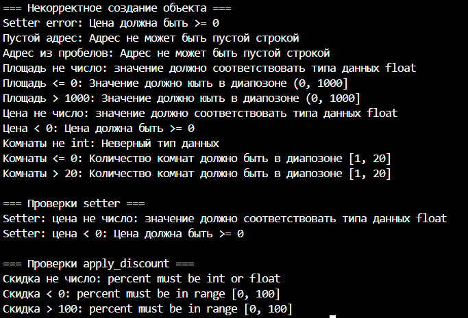

# Сущность: квартира(Apartment)

# Реализованный класс Apartment
**Закрытые поля:**

- `adress` (адрес)
- `area` (площадь)
- `price` (цена)
- `rooms` (кол-во комнат)

**Свойства @property:**
- Чтение: `adres`
- Чтение: `area`
- Чтение: `rooms`
- Чтение и запись: `price`

*Какие инварианты?*

- Адрес - не может быть пусто строкой
- Площадь - число в дипозоне от 1 до 1000 кв.м
- Цена - не может быть отрицательным числом. Тип данных должен соответсовать __int/float__
-Комнаты - число в диапозоне от 1 до 20
--
После измения цены, цена должна пройти проверку на неотрицательное число (apply_discount())

*Что значит “равенство”?*

Равными считаются объектами с одинаковым адресом, кол-вом комнат, площадью, НО отличающейся ценой

*Есть ли состояние?*

Квартира может стоять на продаже/не стоять на продаже (В данной работе это не реализованно)

# магические методы:
- `__str__` - красивый вывод для пользователя
- `__repr__` - техническое представление
используется для отладки
- `__eq__` - сравнение объектов через `==`

# Бизнес методы:
- `price_per_sqm()` - показывает цену за 1 кв. метр
- `apply_discount(self, percent: float)` - применяет скидку

# Демонстрация

**Создание объекта** 

**Методы**

**Проверки**

